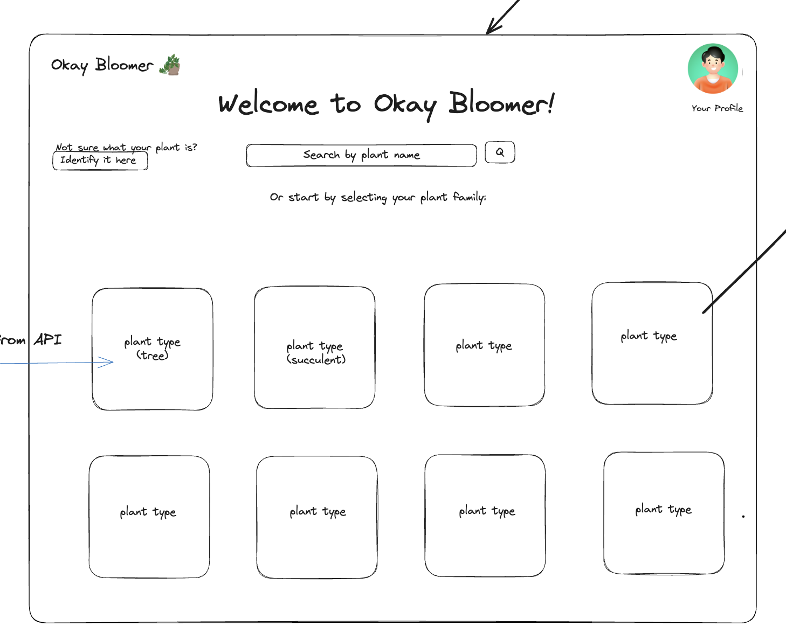
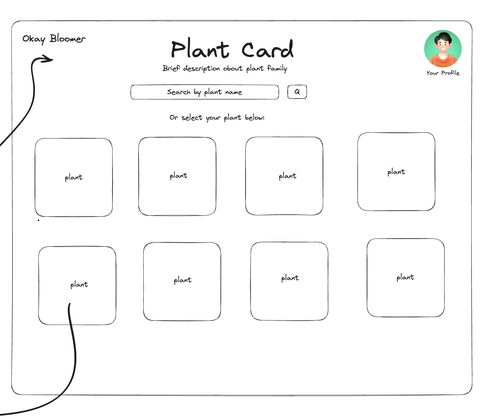
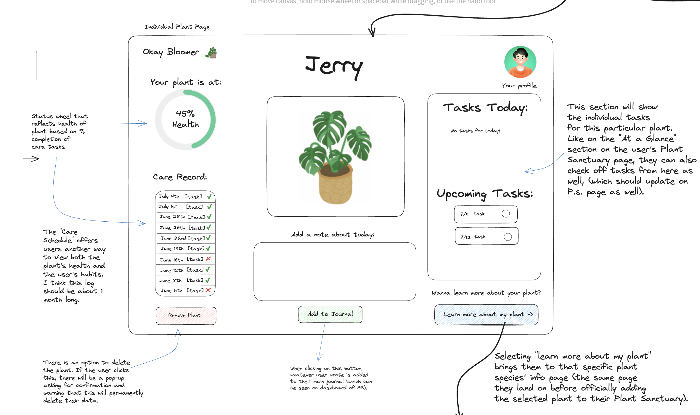
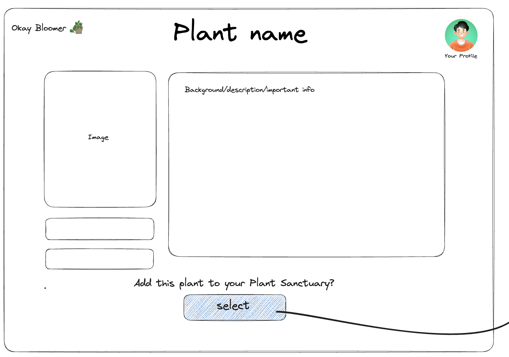
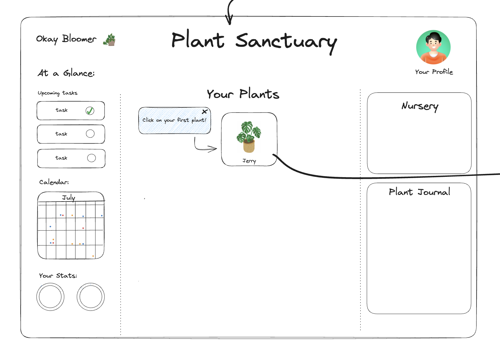

This is a [Next.js](https://nextjs.org/) project bootstrapped with [`create-next-app`](https://github.com/vercel/next.js/tree/canary/packages/create-next-app).

# Okay Bloomer - Plant Care App

Welcome to Okay Bloomer, your ultimate plant care companion! This app is designed to help you take care of your beloved plants, providing you with features to search for plants, create a plant sanctuary, and keep track of their care needs.

## Features
* **Plant Search:** Easily find plants by their types or their name, making it simple to add new plants to your collection.

* **Plant Sanctuary:** Create your own plant sanctuary page where you can keep track of all your plants. Give each plant a special nickname to make them feel even more special!

* **Watering Schedule:** Never forget to water your plants again! Okay Bloomer will provide you with reminders on how often to water each plant.

* **Sunlight Requirements:** Learn about the amount of sunlight each plant needs to thrive and stay healthy.

* **Plant Journal:** Keep a plant journal and jot down your observations, experiences, or any changes in your plants over time. 🌱

## Target User Demographic
This plant care app is for anyone as it has many specific features for a large target audience including:

* **Beginner Plant Enthusiasts:** Okay Bloomer is useful for individuals who are new to gardening and plant care. Beginners often seek guidance and information on how to care for specific plants, and Okay Bloomer can provide valuable tips and reminders.

* **Working Professionals:** Busy professionals who love plants but have limited time to care for them may find Okay Bloomer helpful. Okay Bloomer offers watering reminders, care schedules, and maintenance tips, making it easier for professionals to keep their plants healthy.

* **Home Decor Enthusiasts:** Okay Bloomer is for those who consider houseplants as a part of their home decor. They often enjoy experimenting with different plant types and incorporating green elements into their living spaces.

* **Community Builders:** Okay Bloomer fosters a sense of community among users. Those who enjoy sharing their plant experiences, tips, and advice with others may be more active on Okay Bloomer. 🌿

## Wireframes






## Installation Instructions
Okay Bloomer is a Full Stack web application using MongoDB, Express, Next.js, React.js (a.k.a MERN stack) along with Bulma CSS framework.  Follow these steps below to get this application up and running.
Before you continue, ensure you have installed the following software:
* Node.js
* npm
* MongoDB

**Clone the repository:**
``` ```

**Install Dependencies:**
```npm install```

**Configuring Enviornment Variables:**
Create a `.env` file at the root directory and include your enviornment variable like so:
```MONGO_URI=<Your MongoDB URI```

Replace `<Your MongoDB URI>` with the actual connection string to your MongoDB database.

**Running the Application**
Start the application in development mode:
```npm run dev```


## Blockers: 
Some blockers we faced include:
* Connecting components together.
* Developing a robust calendar handling system to schedule watering reminders and other plant care tasks accurately was new and challenging.
* Defining and validating prop types for each component to ensure that the correct data is passed down from parent to child components.

## Stretch Goals:
**Enhanced Task Management:** Improve upcoming tasks logic to handle multiple tasks for one plant. Implement functionality to edit, remove, and adjust task frequency per plant.

**Calendar Customization:** Enable the calendar to display multiple task types (such as pruning, potting, etc.) with differentiated markers. Tasks for a specific date should be displayed when the user hovers over it.

**User Notifications:** Implement a notification system to remind users of pending tasks. Notifications should respect the user's timezone for task deadlines.

**Plant Nicknames:** Provide the ability to edit the nickname of a plant on an individual user plant page.
Journal Entries Management: Enable users to edit and delete their journal entries.

**Enhanced User Interface:** Incorporate smoother CSS and animations, improving the loading status indicators and page transitions.

**Plant Sharing and Co-parenting:** Introduce a feature to share plants with friends, including a co-parenting option where additional users can receive task notifications.

**Custom Task Creation:** Allow users to create their own task types.

### Developed By:
**Jonathan Davila:** Full-Stack Development
**Jessica Lee:** Front-End Development
**Caleb-Joshua Monzon:** Back-End Development
**Sydney Pogue:** Full-Stack Development

First, run the development server:

```bash
npm run dev
# or
yarn dev
# or
pnpm dev
```

Open [http://localhost:3000](http://localhost:3000) with your browser to see the result.

You can start editing the page by modifying `app/page.js`. The page auto-updates as you edit the file.

This project uses [`next/font`](https://nextjs.org/docs/basic-features/font-optimization) to automatically optimize and load Inter, a custom Google Font.

## Learn More

To learn more about Next.js, take a look at the following resources:

- [Next.js Documentation](https://nextjs.org/docs) - learn about Next.js features and API.
- [Learn Next.js](https://nextjs.org/learn) - an interactive Next.js tutorial.

You can check out [the Next.js GitHub repository](https://github.com/vercel/next.js/) - your feedback and contributions are welcome!

## Deploy on Vercel

The easiest way to deploy your Next.js app is to use the [Vercel Platform](https://vercel.com/new?utm_medium=default-template&filter=next.js&utm_source=create-next-app&utm_campaign=create-next-app-readme) from the creators of Next.js.

Check out our [Next.js deployment documentation](https://nextjs.org/docs/deployment) for more details.
